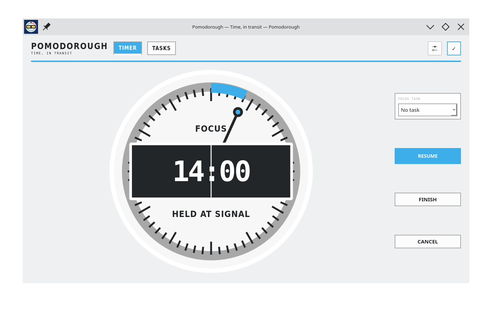

# Pomodorough for Linux and Windows

<p align="center">
  
</p>

<p align="center">
  Desktop, command-line, and terminal clients for the local-first Pomodorough timer.
</p>

<p align="center">
  <a href="https://pomodorough.egigoka.me">Web app</a> |
  <a href="https://github.com/egigoka/pomodorough-server">Server</a> |
  <a href="https://pomodorough.egigoka.me/openapi.yaml">API specification</a>
</p>

<p align="center">
  
</p>

Pomodorough combines a native Qt desktop interface with scriptable
CLI and keyboard-driven TUI clients. All three share one SQLite database. Timer
actions, tasks, and duration changes are committed locally before they appear
on screen, then reconciled with the Pomodorough service when signed in.

## Highlights

- Native PySide6 desktop interface for Linux and Windows
- Standalone Windows executable with no Python installation required
- CLI with human-readable and JSON output for scripts and status integrations
- Lightweight TUI for keyboard-first timer control
- Durable SQLite command, task, and duration queues
- Fully functional offline mode without an account
- Google OAuth with PKCE and a temporary loopback callback
- Secret Service or KWallet token storage on Linux with a user-profile file fallback
- Server-Sent Event revision stream for low-latency cross-device updates
- Deterministic hybrid logical clock merge and optimistic local replay
- User-local Linux installation compatible with SteamOS's immutable root

## Requirements

- Python 3.11 or newer
- Windows 10 or newer, or a Linux desktop session, for the Qt application
- Optional Linux `secret-tool` integration for Secret Service or KWallet storage
- Optional [`uv`](https://docs.astral.sh/uv/) for faster installation

PySide6 is installed as a Python dependency.

## Run from source

```sh
python3 -m venv .venv
.venv/bin/pip install -e .
.venv/bin/pomodorough
```

On Windows PowerShell:

```powershell
py -3.11 -m venv .venv
.venv\Scripts\python -m pip install -e .
.venv\Scripts\pomodorough.exe
```

The desktop application can run entirely offline. Google sign-in enables
cross-device synchronization with the production service.

## Install

### Windows

Download `Pomodorough-<version>-windows-x86_64.exe` and its matching `.sha256`
file from the [latest GitHub release](https://github.com/Pomodoro-Everywhere/pomodorough-desktop/releases/latest).
The executable includes Python, Qt, and all application dependencies, so it can
run directly without installation.

Windows builds are currently unsigned and may trigger a Microsoft Defender
SmartScreen warning. Verify the downloaded executable against its published
SHA-256 checksum before running it.

### Linux distributions

Install Python and its virtual environment support with your distribution's
package manager. For example:

```sh
# Debian or Ubuntu
sudo apt install python3 python3-venv curl

# Fedora
sudo dnf install python3 curl

# Arch Linux
sudo pacman -S python curl
```

Download the release source and install the desktop entry, icon, virtual
environment, and all three executables below `~/.local`:

```sh
curl -LO https://github.com/Pomodoro-Everywhere/pomodorough-desktop/releases/download/v0.1.4/pomodorough_linux-0.1.4.tar.gz
tar -xzf pomodorough_linux-0.1.4.tar.gz
cd pomodorough_linux-0.1.4
./deploy/install.sh
```

No system files are modified.

### SteamOS

SteamOS users with a Nix-managed shell can force the system Python while still
making `uv` available:

```sh
PATH="$HOME/.nix-profile/bin:$PATH" \
  env -u LOCALE_ARCHIVE_2_27 \
  POMODOROUGH_PYTHON=/usr/bin/python3 \
  ./deploy/install.sh
```

### NixOS

Install the package directly from the tagged GitHub release:

```sh
nix profile install github:Pomodoro-Everywhere/pomodorough-desktop/v0.1.4
```

### Flatpak

Download and install the x86-64 bundle attached to the GitHub release:

```sh
curl -LO https://github.com/Pomodoro-Everywhere/pomodorough-desktop/releases/download/v0.1.4/Pomodorough-0.1.4-x86_64.flatpak
flatpak install --user ./Pomodorough-0.1.4-x86_64.flatpak
flatpak run me.egigoka.Pomodorough
```

The bundle is distributed only through GitHub Releases, not Flathub.

### Homebrew

```sh
brew tap egigoka/tap
brew trust --tap egigoka/tap
brew install pomodorough
```

The formula installs `pomodorough`, `pomodorough-cli`, and `pomodorough-tui`.

## Command line

The CLI operates on the same local state as the desktop application:

```sh
pomodorough-cli status
pomodorough-cli start focus --minutes 25
pomodorough-cli pause
pomodorough-cli resume
pomodorough-cli finish
pomodorough-cli cancel
pomodorough-cli clear
pomodorough-cli history --limit 10
```

Use `focus`, `short-break`, or `long-break` as the optional `start` phase. Add
`--json` to status, history, or timer actions for machine-readable output. Pass
`--data PATH` to use a separate SQLite database.

## Terminal UI

```sh
pomodorough-tui
```

| Key | Action |
| --- | --- |
| `Space` | Start, pause, or resume |
| `f` | Finish current timer |
| `x` | Cancel current timer |
| `c` | Clear completed or cancelled timer |
| `1`, `2`, `3` | Select focus, short break, or long break |
| `+`, `-` | Adjust selected duration |
| `q` | Quit |

Use `pomodorough-tui --data PATH` to open a custom database.

## Synchronization

Local operations are durable before UI state changes. Signed-in clients submit
pending work through the authoritative sync endpoint and replay any remaining
operations over the returned canonical snapshot. An authenticated SSE stream
announces remote revisions immediately; periodic polling remains a fallback.

Task IDs derive from normalized titles, so deleting and recreating a task
restores its historical focus totals. Focus sessions may be assigned to an
active task or remain unassigned.

## Google sign-in

The production Google OAuth desktop client ID is bundled with the package;
no client secret is distributed. Authorization opens the system browser, uses
PKCE, and returns through a temporary loopback callback.

Override the OAuth configuration with either
`POMODOROUGH_GOOGLE_OAUTH_JSON` or this file:

```text
~/.config/pomodorough/google-oauth.json
```

Any replacement client ID must be present in the server's
`GOOGLE_NATIVE_CLIENT_IDS`. Refresh tokens are stored through Secret Service
when `secret-tool` is available, with a mode-0600 JSON file fallback.

## Local data

| Data | Default location |
| --- | --- |
| Linux timer, tasks, history, settings, queues | `~/.local/share/pomodorough/pomodorough.sqlite3` |
| Windows timer, tasks, history, settings, queues | `%LOCALAPPDATA%\pomodorough\pomodorough.sqlite3` |
| Linux OAuth file fallback and override | `~/.config/pomodorough/` |
| Windows OAuth file fallback and override | `%APPDATA%\pomodorough\` |
| Linux installed virtual environment | `~/.local/share/pomodorough/venv` |
| Linux executable links | `~/.local/bin/` |

`XDG_DATA_HOME` and `XDG_CONFIG_HOME` are respected on Linux. Windows uses its
standard local and roaming application-data directories.

## Architecture

| Module | Responsibility |
| --- | --- |
| `ui.py` | Qt desktop interface, rendering, and revision-driven sync |
| `storage.py` | SQLite schema, migrations, queues, and canonical reconciliation |
| `network.py` | OAuth, token rotation, HTTP sync, and SSE revision stream |
| `terminal.py` | Shared local timer operations for CLI and TUI clients |
| `cli.py` | Scriptable command-line interface |
| `tui.py` | Interactive terminal interface |

## Testing

```sh
python3 -m unittest discover -s tests -v
python3 -m compileall -q src tests
uvx ruff check .
sh -n deploy/install.sh
```

## Pomodorough projects

- [Server, Web/PWA, and synchronization](https://github.com/Pomodoro-Everywhere/pomodorough-server)
- [Apple](https://github.com/Pomodoro-Everywhere/pomodorough-apple)
- [Android](https://github.com/Pomodoro-Everywhere/pomodorough-android)
- [Desktop (this repository)](https://github.com/Pomodoro-Everywhere/pomodorough-desktop)

## License

Pomodorough is licensed under the GNU General Public License v3.0 or
later. See [LICENSE](LICENSE).
